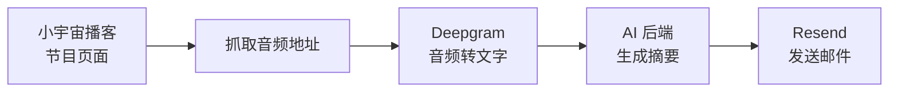

# podcast-digest · 播客摘要小助手

自动追你订阅的小宇宙播客，把每期节目转成文字，再用 AI 生成摘要，并发送到你的邮箱。



如果上面的图没有显示，流程就是：

```text
小宇宙播客 -> 抓取音频 -> Deepgram 转文字 -> AI 生成摘要 -> Resend 发邮件
```

---

## 开始前要准备什么

这个项目不是下载后就能直接跑。它会调用几个在线服务，所以你需要先准备对应的 API key。

### 只想转文字

如果你只想把某一期小宇宙节目转成文字，需要：

- macOS 或 Linux
- `bash`
- `curl`
- `python3`
- 一个 Deepgram API key

Deepgram 用来把音频转成文字。你需要去 Deepgram 官网注册账号，然后创建 API key。

### 想要完整邮件摘要

如果你想自动完成“转文字 -> 生成摘要 -> 发邮件”，还需要：

- 一个 Resend API key
- 一个可以发信的 Resend 发件邮箱或已验证域名
- 一个 AI 后端

AI 后端目前支持：

- `claude`
- `codex`
- `anthropic`
- `openai`
- `gemini`
- `ollama`

如果你只有 Codex、没有 Claude Code 或其他 AI API key，可以选择 `codex` 后端。前提是你的电脑上已经安装并登录了 Codex CLI。注意：`codex` 只负责“生成摘要”这一步；转文字仍然需要 Deepgram，发邮件仍然需要 Resend。

如果你用 GLM、Kimi、DeepSeek、Qwen 这类 OpenAI-compatible 服务，选择 `openai` 后端，然后在 `config.sh` 里填写对应的 `OPENAI_BASE_URL`、`OPENAI_API_KEY` 和 `OPENAI_MODEL`。

---

## 安装

```bash
git clone <你的仓库地址> podcast-digest
cd podcast-digest
cp config.example.sh config.sh
cp channels.tsv.example channels.tsv
chmod +x digest.sh fetch_transcript.sh
```

---

## 只转文字：最快测试方式

打开 `config.sh`，先只填 Deepgram：

```bash
export DEEPGRAM_KEY="your_deepgram_api_key"
```

然后运行：

```bash
./fetch_transcript.sh "https://www.xiaoyuzhoufm.com/episode/..."
```

转写结果会保存到：

```text
/tmp/podcast-digest/transcript.txt
```

这一步不需要 Resend，也不需要 AI key。

---

## 完整邮件摘要：配置频道和邮件

如果你要让它追踪播客并自动发摘要邮件，继续配置下面几项。

### 1. 配置 `config.sh`

打开 `config.sh`，至少填写：

```bash
export DEEPGRAM_KEY="your_deepgram_api_key"
export RESEND_KEY="your_resend_api_key"

RECIPIENT_EMAIL="you@example.com"
FROM_EMAIL="onboarding@resend.dev"

export LLM_BACKEND="claude"
```

如果你只有 Codex，可以这样：

```bash
export LLM_BACKEND="codex"
```

这会调用本机的 `codex exec` 来生成摘要，不需要额外填写 AI API key，但需要你已经在本机登录 Codex。
Deepgram 和 Resend 仍然必须配置，因为它们分别负责转文字和发邮件。

如果你不用本地 Claude Code，而是用 OpenAI 或 OpenAI-compatible 服务，可以这样：

```bash
export LLM_BACKEND="openai"
export OPENAI_API_KEY="your_openai_or_compatible_key"
export OPENAI_MODEL="gpt-4o"
export OPENAI_BASE_URL="https://api.openai.com/v1"
```

### 2. 配置 `channels.tsv`

一行一个节目，格式是：

```text
节目名称<TAB>播客ID<TAB>plain
```

这里的 `<TAB>` 是键盘上的 Tab 键，不是空格。

小宇宙播客 ID 在节目页 URL 里。例如：

```text
https://www.xiaoyuzhoufm.com/podcast/xxxxxxxxxxxxxxxxxxxxxxxx
```

最后那串就是播客 ID。

### 3. 第一次先 seed

第一次运行建议先 seed，把当前最新节目记为已读，避免一上来处理一堆旧节目：

```bash
./digest.sh --seed
```

### 4. 正式运行

```bash
./digest.sh
```

之后每次有新节目，再运行这条命令，它就会转写、生成摘要并发邮件。

---

## 常用命令

| 我想做什么 | 命令 |
|---|---|
| 标记当前最新节目为已读 | `./digest.sh --seed` |
| 正常处理新节目 | `./digest.sh` |
| 强制处理某个播客的最新一期 | `./digest.sh --force <播客ID>` |
| 只转写某一期节目 | `./fetch_transcript.sh <单集网址>` |

---

## AI 后端怎么选

默认是：

```bash
export LLM_BACKEND="claude"
```

这会调用本机的 Claude Code CLI。如果你已经装好了 Claude Code，这是最省事的方式，不需要额外填写 AI API key。

如果你只有 Codex，可以改成：

```bash
export LLM_BACKEND="codex"
```

这会调用本机的 Codex CLI：

```bash
codex exec
```

`codex` 后端适合已经安装并登录 Codex、但没有 Claude Code 或其他 AI API key 的用户。
它只替代 AI 摘要后端，不替代 Deepgram 或 Resend。

API 和本地模型后端走 `llm_call.py`：

| 后端 | 需要配置 |
|---|---|
| `codex` | 本机已安装并登录 Codex CLI |
| `anthropic` | `ANTHROPIC_API_KEY`, `ANTHROPIC_MODEL` |
| `openai` | `OPENAI_API_KEY`, `OPENAI_MODEL`, `OPENAI_BASE_URL` |
| `gemini` | `GEMINI_API_KEY`, `GEMINI_MODEL` |
| `ollama` | `OLLAMA_HOST`, `OLLAMA_MODEL` |

---

## macOS 定时运行

复制 launchd 配置：

```bash
cp launchd/com.podcast-digest.plist.example ~/Library/LaunchAgents/com.podcast-digest.plist
```

编辑这个 plist 文件，把里面的 `__REPO__` 和 `__HOME__` 换成你的真实路径，然后启用：

```bash
launchctl bootstrap gui/$(id -u) ~/Library/LaunchAgents/com.podcast-digest.plist
```

Linux 用户可以用 cron 调度 `digest.sh`。

---

## 隐私和限制

- `config.sh`、`custom_layer.txt` 和 `.state.json` 不应提交到 Git 仓库。
- Deepgram、Resend、OpenAI 等服务可能产生用量费用，请以各自官网为准。
- 机器转写不一定完美，中文播客可能会有同音字或说话人识别错误。
- 这是个人自动化工具，不是生产级服务。

---

## License

MIT
